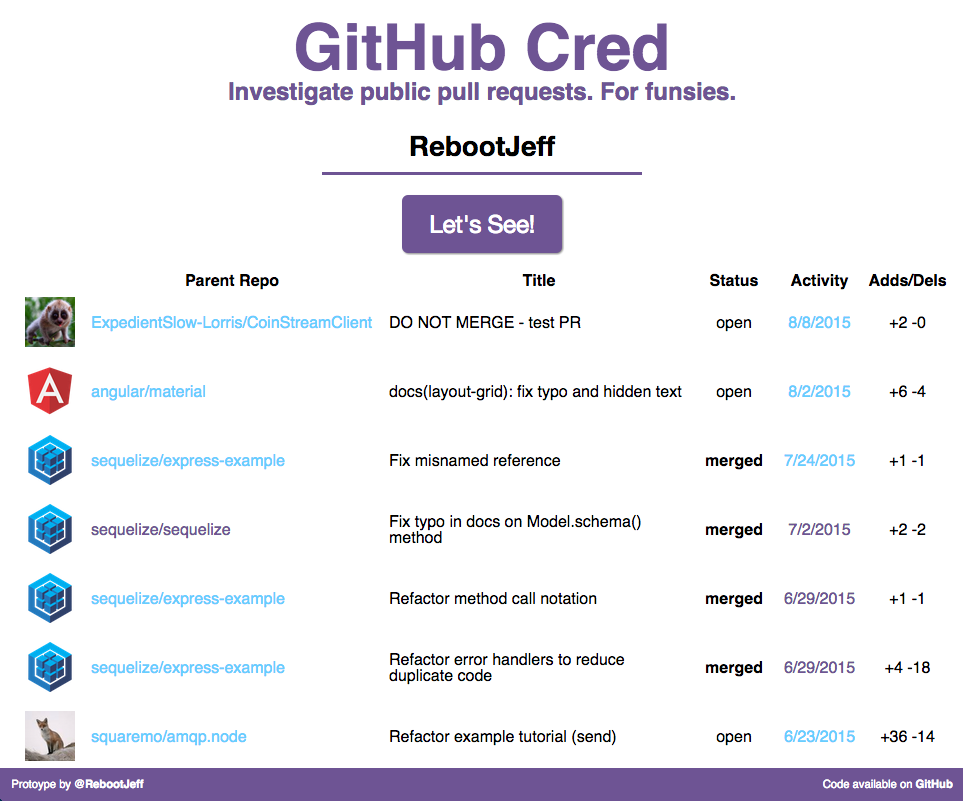

# GitHub Cred

**[Prototype is ready HERE](http://github-cred.herokuapp.com/)**. Thanks for holding your breath :grin:, but keep in mind that I plan on re-writing large portions of the app and re-deploying with a different architecture.

Usage:

1. Enter a GitHub username; receive a list contributions to others' repos.
2. Scrutinize contributions.
3. Be super ~~judgemental~~ encouraging to the GitHub user.

<!-- START doctoc generated TOC please keep comment here to allow auto update -->
<!-- DON'T EDIT THIS SECTION, INSTEAD RE-RUN doctoc TO UPDATE -->
**Table of Contents**  *generated with [DocToc](https://github.com/thlorenz/doctoc)*

- [Screenshots](#screenshots)
- [Development](#development)
  - [Main Tech](#main-tech)
  - [Challenges](#challenges)
  - [Credits](#credits)

<!-- END doctoc generated TOC please keep comment here to allow auto update -->

## Screenshots

## Development

The app will use the GitHub API (v3) to find a given user's contributions.

0. Search for all of a user's PRs.
0. Filter for PRs that target repos not owned by user.
0. Request details for each PR.
0. Extract interesting PR data:
  - Main - title, body, target repo
  - Stats - additions, deletions, commits, etc.
  - Status - open, close, merged
  - Timestamps - created, modified, merged, closed
0. Highlight merged PRs.

GitHub API interactions will take place on the server side to make use of a rate-limit-conquering (well, kinda) personal access token. Read the Challenges section of this README for more details. You know you wanna.

### Main Tech

*Work In Progress*

- Server-side
  - GitHub API v3
  - Node.js w/Express
  - Ramda.js
  - Jasmine
  - Helmet
- Client-side:
  - Vanilla JS
  - Browserify
  - Ramda.js
- Dev Ops
  - CircleCI
  - Heroku

### Challenges

**Problem:** Naming functions/variables when writing code in *functional programming* style is 10x harder.
**Solution:** Just do it.

**Problem:** Dealing with [GitHub API rate limits](https://developer.github.com/v3/#rate-limiting).
The rate limit on vanilla requests to the GitHub Search API is 10 requests/minute. I burn through that limit like nobody's business because I gotta send roughly 2 bajillion test requests/breath during development.
**Solution:** Use an access token with each request.
Using a valid access token increases the rate limit to 30 requests/minute/token. For prototyping speed's sake, I will rely on a [Personal Access Token](https://help.github.com/articles/creating-an-access-token-for-command-line-use/). The "proper" solution would involve requiring a visitor to log into the app via GitHub OAuth. Then I would use the authenticated visitor's access token.

**Problem:** Hiding my Personal Access Token. You can't expose that shit within a public codebase.
**Solution:** Use an environment variable.
Any reliance on the token must take place on the private server. The token is stored in an environment variable. When developing locally, the token is stored in a file that is never committed as part of this repo's public codebase.

**Problem:** Coming to terms with the fact that I wasted so much time going through a convoluted set of GitHub API queries before realizing there was a powerful GitHub Search API.
**Solution:** Venting to my fellow coding friends.

**Problem:** Friends get tired of my venting.
**Solution:** Unknown.

**Problem:** Trying to learn functional programming.
**Solution:** Focus on [fundamentals of curry, compose, etc](http://rebootjeff.github.io/blog/2015/06/14/refactoring-towards-functional-programming-in-javascript/) before worrying about applicatives, functors, etc.

### Credits
- Author: [RebootJeff](https://twitter.com/RebootJeff)
- Cat gif: [Thomas Bogner](https://dribbble.com/shots/1168363-calming-cat-GIF)
